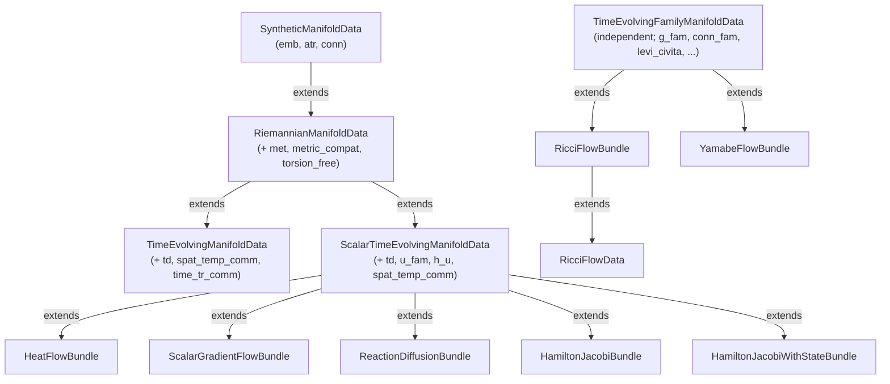

# Synthetic

This layer formalizes Riemannian geometry and geometric PDEs via Serre–Swan duality. A smooth manifold $M$ is represented by an algebraic triple $(k, R, V)$: the ground field $k = \mathbb{R}$, the commutative ring $R = C^\infty(M, \mathbb{R})$, and the $R$-module $V = \Gamma(TM)$. All differential-geometric structures—connections, curvature, differential operators—are then statements about $R$-module maps, derivations, and multilinear forms over $(R, V)$.

The layer splits into two halves.

---

## Algebraic half

The algebraic half works entirely over an abstract commutative ring $R$ and $R$-module $V$, with no reference to manifolds, charts, or Mathlib's smooth-manifold infrastructure. The cost is a collection of axioms packaging the properties that hold in the concrete setting.

### Core structures (`Algebra/`)

**`DerivationEmbedding k R V`.** An $R$-linear injection $V \hookrightarrow \mathrm{Der}_k(R, R)$, closed under the Lie bracket. This is the Serre–Swan avatar of "vector fields act as derivations on smooth functions." From this single structure one derives: directional derivatives $X(f)$, the Lie bracket $[X, Y]$, and their algebraic identities (Jacobi, antisymmetry, Leibniz with correction term).

**`AbstractTrace R V`.** An $R$-linear map $\mathrm{tr} : \mathrm{End}_R(V) \to R$ satisfying $\mathrm{tr}(\alpha \otimes v) = \alpha(v)$ and $\mathrm{tr}(AB) = \mathrm{tr}(BA)$, together with a general tensor contraction operator. This replaces Mathlib's `LinearMap.trace`, which requires `Module.Free`—the algebraic counterpart of parallelizability.

**`MetricDuality R V`.** A symmetric $(0,2)$-tensor $g$ with inverse $g^{-1}$, non-degeneracy, and surjectivity of the flat map $\flat : V \to V^*$. Provides $\sharp$, $\flat$, index raising/lowering, and metric trace.

**`TimeDerivativeData R A Time`.** A Mathlib `Derivation R A A` representing $\partial_t$, together with a lift/eval pair connecting the abstract algebra $A$ to families $\mathrm{Time} \to R$. Additivity, Leibniz, and the killing of constants are free from the `Derivation` API.

### Regularity filters (`TimeRegularFam`, `TimeRegularFam2`)

The predicate `TimeRegularFam` identifies a distinguished class of "regular" time-dependent families $f : \mathrm{Time} \to R$ on which `lift` and `eval` are mutual inverses and which is closed under $+, \times, -$. In the concrete setting this class is the jointly smooth families.

`TimeRegularFam2` extends this to two-time families $G : \mathrm{Time} \times \mathrm{Time} \to R$. Its key axiom is the **diagonal chain rule**:

$$\partial_\tau\big[G(\tau, \tau)\big]\big|_t \;=\; \partial_\tau\big[G(\tau, t)\big]\big|_t \;+\; \partial_\tau\big[G(t, \tau)\big]\big|_t.$$

This identity is used in the Ricci flow evolution equations whenever the metric and the connection both vary in time.

### Connecting axioms

- `SpatialTemporalComm`: $\partial_t \circ X = X \circ \partial_t$ on smooth families.
- `NablaTrComm`: $X(\mathrm{tr}\, L) = \mathrm{tr}[\nabla_X, L]$.
- `TimeTrComm`: $\partial_t(\mathrm{tr}\, L) = \mathrm{tr}(\dot{L})$.
- `NablaTensorContractComm`: $\nabla_X \circ C = C \circ \nabla_X$ where $C$ is tensor contraction.
- `IsMetricCompatible`, `IsTorsionFree`, `IsLeviCivita`.

### Geometry (`Geometry/`)

Affine connections, the Riemann curvature tensor $\mathrm{Rm}(X, Y)Z = \nabla_X \nabla_Y Z - \nabla_Y \nabla_X Z - \nabla_{[X,Y]} Z$, the Koszul formula, multilinearity of $\mathrm{Rm}$, the Ricci identity, both Bianchi identities, and the Ricci tensor $\mathrm{Rc}$.

### Differential operators (`Operator/`)

Gradient, Hessian, Laplacian, divergence, covariant derivative, second covariant derivative, Lie derivative, metric variation, the Bochner identity, and related Weitzenböck-type formulas.

### Analysis (`Analysis/`)

Extension of $\nabla$ to arbitrary $(r, s)$-tensors via the Leibniz rule on each slot. Extension of $\partial_t$ to time-dependent tensors. A product-rule axiom `NablaTimeProductRule` for $\partial_t$ and $\nabla$ with time-varying connections.

### Assembly (`Assembly.lean`)

Bundles axioms into progressive structures:

| Structure | Data |
|---|---|
| `SyntheticManifoldData` | `emb`, `atr`, `conn`, connection axioms, `NablaTrComm`, `NablaTensorContractComm` |
| `RiemannianManifoldData` | + `MetricDuality`, metric compatibility, torsion-free |
| `TimeEvolvingManifoldData` | + `TimeDerivativeData`, `SpatialTemporalComm`, `TimeTrComm` |
| `ScalarTimeEvolvingManifoldData` | + scalar state $u(t)$ with smoothness proof |
| `TimeEvolvingFamilyManifoldData` | + family of metrics $g(t)$, connections $\nabla^{(t)}$, Levi-Civita at each time |
| `RicciFlowBundle` | + `TimeRegularFam2`, Ricci flow equation, `NablaTimeProductRule` |

### Flows (`Flow/`)

Downstream applications. Given the appropriate bundle, one derives evolution equations:

- **Ricci flow** (`Flow/RicciFlow/`): evolution of $\nabla$, $\mathrm{Rm}$, $\mathrm{Rc}$, $\mathrm{Scal}$, $|\nabla f|^2$, $\Delta f$ under $\partial_t g = -2\,\mathrm{Rc}$.
- **Yamabe flow**, **heat equation**, **gradient flow**, **reaction-diffusion**, **Hamilton–Jacobi**: stub structures consuming `ScalarTimeEvolvingManifoldData` or `TimeEvolvingManifoldData`.

---

## Realization half (`Realization/`)

The realization half constructs concrete instances of every axiom from Mathlib's smooth-manifold library, bridging the abstract algebraic layer to the differential-geometric infrastructure.

### Concrete instantiation

In `Basic.lean`: $k = \mathbb{R}$, $R = C^\infty\langle I, M; \mathbb{R}\rangle$, $V = \Gamma^\infty(TM)$. The file verifies the required algebraic instances (`CommRing`, `Algebra`, `Module`, `IsScalarTower`) and constructs `Invertible (2 : R)`.

### Joint smoothness

A time-dependent family $f : \mathbb{R} \to C^\infty(M, \mathbb{R})$ is **jointly smooth** when the uncurried map

$$(\tau, x) \;\mapsto\; f(\tau)(x)$$

is $C^\infty$ on $\mathbb{R} \times M$ with the product model $\mathcal{I}(\mathbb{R}, \mathbb{R}) \times I$. This is `concreteIsSmoothFam` in `TimeDeriv.lean`. The two-time analogue is:

$$\big((\tau_1, \tau_2),\, x\big) \;\mapsto\; f(\tau_1, \tau_2)(x)$$

is $C^\infty$ on $(\mathbb{R} \times \mathbb{R}) \times M$. This is `concreteIsSmoothFam2` in `TimeJointSmoothness.lean`. The diagonal chain rule is proved by applying the Fréchet derivative chain rule to the scalar function $F(\tau_1, \tau_2) = G(\tau_1, \tau_2)(x_0)$ at each base point $x_0$, using the linearity $L(1, 1) = L(1, 0) + L(0, 1)$ of the total derivative.

### Koszul–Germ bridge

The largest files (`KoszulCov.lean`, `KoszulGerm.lean`, `NablaContractSynthetic.lean`, `TensorContract.lean`, `TimeDeriv.lean`) realize the abstract trace, tensor contraction, Levi-Civita connection, and time derivative from Mathlib's `CovariantDerivative`, `ContMDiff`, and `SmoothSection` API.

### Assumptions

Currently, the only assumptions are:

1. A time-dependent family of Riemannian metrics $g(t)$ exists on a smooth manifold $(M, I)$.
2. The metric components are **jointly smooth**: for every choice of vector and covector arguments, the map $(\tau, x) \mapsto g(\tau)(\cdots)(x)$ is $C^\infty$ on $\mathbb{R} \times M$.
3. A geometric PDE governs the evolution (e.g., $\partial_t g = -2\,\mathrm{Rc}$).

Under these hypotheses, the realization half discharges every axiom in the corresponding `Assembly.lean` structure. The algebraic half then derives evolution equations, Bianchi identities, Bochner formulas, and whatever else follows—without touching Mathlib again.

These assumptions are not verified within the Synthetic layer itself. They will be discharged by a concrete PDE layer via DeTurck's trick, which establishes short-time existence and joint smoothness of the solution.
