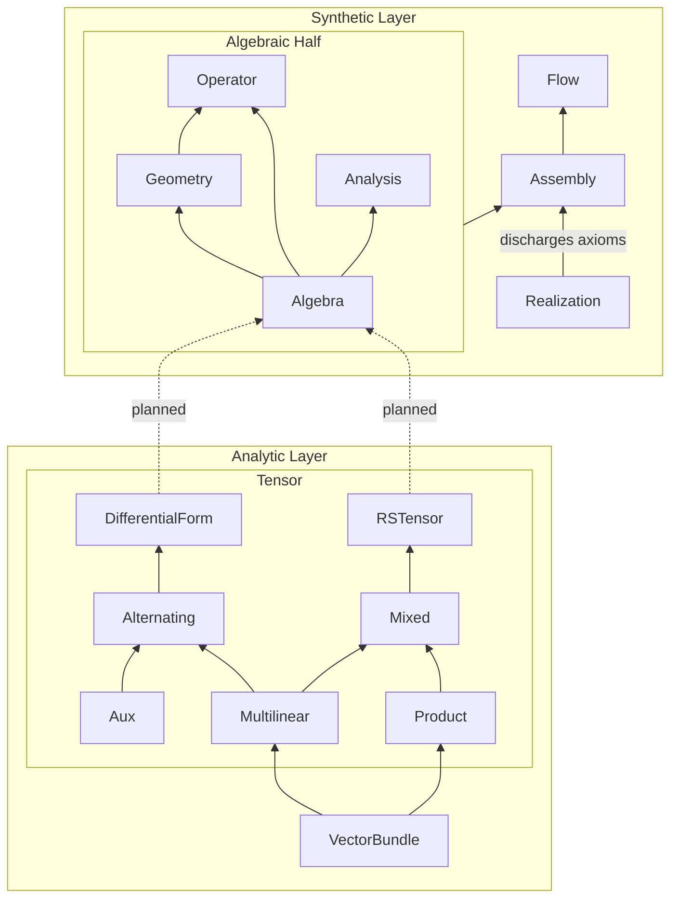

# Differential Geometry in Lean 4

A formalization of differential geometry in Lean 4, from vector bundles and tensor algebra to curvature and geometric flows, working towards a complete formalization of Ricci Flow. See [differential-geometry-papers](https://github.com/qinz1yang/differential-geometry-papers) for using the library to formalize papers in differential geometry.


## Project Structure


## Architecture

The goal of this project is to work towards the formalization of Ricci Flow in Lean. The library is split into two layers to preserve modularity: the Synthetic Layer (Ziyang Qin) and the Analytic Layer (Jack McCarthy, with additional code from Yuan Liao and Yury G. Kudryashov) are developed independently.

### Analytic Layer (sorry-free)

A coordinate-aware formalization built directly on Mathlib's smooth manifold library. All proofs are complete — no `sorry` or injected axioms. This layer provides the concrete implementations of vector bundles, tensor products, differential forms, and $(r,s)$-tensor fields that the Synthetic Layer abstracts over.

**VectorBundle** provides foundational infrastructure: module structure for smooth sections ($\Gamma^n(V)$) over the ring of smooth functions, local-to-global frame extensions via bump functions, bundle homomorphisms/equivalences, and dual bundle constructions.

The main result is the **Bundle Homomorphism Characterization Lemma** (`ContMDiffVectorBundleHom.ofLinearMapSection` in `VectorBundle/Section.lean`; Lee, *Introduction to Smooth Manifolds*, Lemma 10.29, p. 262):

> Suppose $E$ and $E'$ are smooth vector bundles over a $C^k$ real manifold $M$ (with or without boundary). Then a map $F : \Gamma(E) \to \Gamma(E')$ is linear over $C^k(M)$ if and only if there exists a smooth bundle homomorphism $f : E \to E'$ such that $F(\sigma) = f \circ \sigma$ for all $\sigma \in \Gamma(E)$.

**Tensor** builds on this to formalize tensor algebra over vector bundles. The characterization lemma is the key engine: to prove a $C^n$ vector bundle equivalence $E_1 \cong E_2$, it suffices to construct a $C^n(M)$-linear equivalence $\Gamma(E_1) \cong \Gamma(E_2)$ at the section level (the corollary `ContMDiffVectorBundleEquiv.ofLinearEquivSection`). This strategy is used to establish the following canonical isomorphisms for any $C^k$ vector bundle $E$ over a smooth manifold $M$:

1. **Tensor product decomposition** ($r' + r'' = r$): $\quad T_r E \cong T_{r'} E \otimes T_{r''} E$
   <br>`multilinearBundle_tensorProduct_equiv` in `Multilinear/TensorSection.lean`

2. **Dual–multilinear interchange**: $\quad (T_r E)^* \cong T_r(E^*)$
   <br>`dualBundle_multilinearOfDual_equiv` in `Multilinear/DualSection.lean`

3. **Mixed tensor splitting** *(in progress)*: $\quad T^r_s E \cong T^r E \otimes T_s E$

Together these yield the full decomposition of the $(r,s)$-tensor bundle into $r$ copies of $E$ and $s$ copies of $E^*$:

$$T^r_s E \cong \underbrace{E \otimes \cdots \otimes E}_{r} \otimes \underbrace{E^* \otimes \cdots \otimes E^*}_{s}$$

In each case, the proof proceeds by defining fiberwise maps, showing they are compatible with local trivializations, and then invoking the characterization lemma to obtain the bundle-level equivalence.

| Subfolder | Description |
|---|---|
| **Multilinear** | Vector bundles of continuous multilinear maps, with fiber/bundle/section-level constructions for duals and tensor products. |
| **Product** | Tensor products of vector bundles, including pretrivializations, fiber structure, and explicit basis/finrank computations. |
| **Mixed** | Mixed $(r,s)$-tensor bundles realized as hom bundles between multilinear bundles, with dual fiber isomorphisms. |
| **RSTensor** | Classical $(r,s)$-tensor fields on smooth manifolds: contractions, metric structures, and Lie derivatives. |
| **Alternating** | Vector bundles of continuous alternating multilinear maps, with wedge products, currying, and basis constructions. Based on code by Yury G. Kudryashov. |
| **DifferentialForm** | Smooth differential $n$-forms as sections of alternating bundles. Based on code by Yury G. Kudryashov. |
| **Auxiliary** | Combinatorial utilities: permutations, multi-index Kronecker deltas, and shuffle decompositions for graded Leibniz rules. |

### Synthetic Layer

Formalizes geometric analysis via Serre–Swan structure.

- **Algebraic half** derives results over abstract $(R, V)$ with no reference to manifolds or charts.
- **Realization half** bridges every axiom to Mathlib's smooth-manifold infrastructure.
- **Key results:** Bochner–Weitzenböck identity, both Bianchi identities, Palatini identity, Ricci flow evolution equations ($\partial_t \nabla$, $\partial_t \mathrm{Rm}$, $\partial_t \mathrm{Rc}$, $\partial_t \mathrm{Scal}$, $\partial_t |\nabla f|^2$, $\partial_t \Delta f$).
- **Irreducible assumptions:** (1) a time-dependent metric family $g(t)$, (2) joint smoothness of the metric components, and (3) a governing PDE (e.g., $\partial_t g = -2\,\mathrm{Rc}$). These will be discharged by a concrete PDE layer via DeTurck's tric in the future.

See [Synthetic/README.md](DifferentialGeometry/Synthetic/README.md) for full details.


## FAQ

**Shouldn't this be part of Mathlib?**

The Analytic Layer is developed with the aim of eventual Mathlib integration — it builds directly on Mathlib's smooth manifold library and is sorry-free. However, the API is still evolving (e.g., the mixed tensor splitting is in progress), and the authors want to stabilize the core isomorphisms before submitting PRs. The Synthetic Layer, being axiom-driven, is not intended for Mathlib.

**How do I use this library?**

There are examples in the `Examples` folder. One illustrates calculation, one illustrates proof.
- **`EuclideanSample.lean`:** Calculation of gradient, Hessian, Laplacian, metric variation, and Ricci curvature in $\mathbb{R}^3$.
- **`HessianSymmetry.lean`:** Proof of Hessian symmetry using Lie derivations. (This is already in the library, but it is a good example.)

**How can I contribute?**

Contributions and suggestions are welcome. Please reach out via email:
- `zq + sqrt(1444) {at} cornell [dot] edu`
- `jack [dot] mccarthy [dot] 1 {at} stonybrook [dot] edu`

(all lower case, no symbols)

## AI Disclaimer

Generative AI (Claude, Gemini, Aristotle) was used in the development of this codebase. The high-level architecture is human-designed; AI agents assisted with formalizing individual proofs and writing boilerplate. All definitions and core theorem statements were human-verified for correctness. Since all proofs are verified by Lean's type checker, AI-generated and human-written code are held to the same standard of correctness. The authors are generally confident about the correctness of the code, but make no guarantees.

## Installation

Ensure you have [Lean 4](https://lean-lang.org/lean4/doc/setup.html) installed.

```bash
# Clone the repository
git clone https://github.com/qinz1yang/differential-geometry
cd differential-geometry

# Build the library
lake build
```

## References
The abstractions and formalizations in this library are heavily inspired by and built upon the following texts:

- Chow, B., et al. Hamilton's Ricci Flow (ISBN 978-1-4704-7369-3).
- Colding, T. H., & Minicozzi II, W. P. A Course in Minimal Surfaces (ISBN 978-1-4704-7640-3).
- Differential Geometry and Applications, Richard Hamilton, Monique Chyba and Xiaodong Cao (This is not published yet.)
- Hongxi Wu, An Introduction to Riemannian Geometry. (2014). Higher Education Press. (This is not a book in English, but it can be found [here](https://www.overdrive.com/media/12444682/黎曼几何初步-preliminary-riemann-geometry). ISBN 978-7-04-040458-6)
- Lee, J. M. Introduction to Smooth Manifolds. 2nd ed. Springer. (ISBN 978-1-4419-9982-5)
