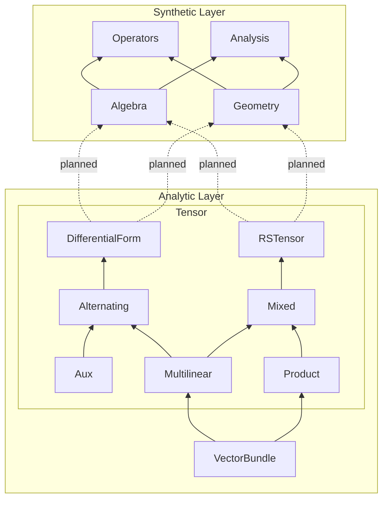

# Differential Geometry in Lean 4

A formalization of differential geometry in Lean 4, from vector bundles and tensor algebra to curvature and geometric flows, working towards a complete formalization of Ricci Flow. See [differential-geometry-papers](https://github.com/qinz1yang/differential-geometry-papers) for using the library to formalize papers in differential geometry.


## Project Structure


## Architecture

The goal of this project is to work towards the formalization of Ricci Flow in Lean. The library is split into two layers to preserve modularity: the Synthetic Layer (Ziyang Qin) and the Analytic Layer (Jack McCarthy, with additional code from Yuan Liao and Yury G. Kudryashov) are developed independently.

### Analytic Layer (sorry-free)

A coordinate-aware formalization built directly on Mathlib's smooth manifold library. All proofs are complete — no `sorry` or injected axioms. This layer provides the concrete implementations of vector bundles, tensor products, differential forms, and $(r,s)$-tensor fields that the Synthetic Layer abstracts over.

**VectorBundle** provides foundational infrastructure: module structure for smooth sections ($\Gamma^n(V)$) over the ring of smooth functions, local-to-global frame extensions via bump functions, bundle homomorphisms/equivalences, and dual bundle constructions.

The main result is the **Bundle Homomorphism Characterization Lemma** (`ContMDiffVectorBundleHom.ofLinearMapSection` in `VectorBundle/Section.lean`; Lee, *Introduction to Smooth Manifolds*, Lemma 10.29, p. 262):

> Suppose $E$ and $E'$ are smooth vector bundles over a $C^k$ real manifold $M$ (with or without boundary). Then a map $F : \Gamma(E) \to \Gamma(E')$ is linear over $C^k(M)$ if and only if there exists a smooth bundle homomorphism $f : E \to E'$ such that $F(\sigma) = f \circ \sigma$ for all $\sigma \in \Gamma(E)$.

**Tensor** builds on this to formalize tensor algebra over vector bundles. The characterization lemma is the key engine: to prove a $C^n$ vector bundle equivalence $E_1 \cong E_2$, it suffices to construct a $C^n(M)$-linear equivalence $\Gamma(E_1) \cong \Gamma(E_2)$ at the section level (the corollary `ContMDiffVectorBundleEquiv.ofLinearEquivSection`). This strategy is used to establish the following canonical isomorphisms for any $C^k$ vector bundle $E$ over a smooth manifold $M$:

1. **Tensor product decomposition** ($r' + r'' = r$): $\quad T_r E \cong T_{r'} E \otimes T_{r''} E$
   <br>`multilinearBundle_tensorProduct_equiv` in `Multilinear/TensorSection.lean`

2. **Dual–multilinear interchange**: $\quad (T_r E)^* \cong T_r(E^*)$
   <br>`dualBundle_multilinearOfDual_equiv` in `Multilinear/DualSection.lean`

3. **Mixed tensor splitting** *(in progress)*: $\quad T^r_s E \cong T^r E \otimes T_s E$

Together these yield the full decomposition of the $(r,s)$-tensor bundle into $r$ copies of $E$ and $s$ copies of $E^*$:

$$T^r_s E \cong \underbrace{E \otimes \cdots \otimes E}_{r} \otimes \underbrace{E^* \otimes \cdots \otimes E^*}_{s}$$

In each case, the proof proceeds by defining fiberwise maps, showing they are compatible with local trivializations, and then invoking the characterization lemma to obtain the bundle-level equivalence.

| Subfolder | Description |
|---|---|
| **Multilinear** | Vector bundles of continuous multilinear maps, with fiber/bundle/section-level constructions for duals and tensor products. |
| **Product** | Tensor products of vector bundles, including pretrivializations, fiber structure, and explicit basis/finrank computations. |
| **Mixed** | Mixed $(r,s)$-tensor bundles realized as hom bundles between multilinear bundles, with dual fiber isomorphisms. |
| **RSTensor** | Classical $(r,s)$-tensor fields on smooth manifolds: contractions, metric structures, and Lie derivatives. |
| **Alternating** | Vector bundles of continuous alternating multilinear maps, with wedge products, currying, and basis constructions. Based on code by Yury G. Kudryashov. |
| **DifferentialForm** | Smooth differential $n$-forms as sections of alternating bundles. Based on code by Yury G. Kudryashov. |
| **Auxiliary** | Combinatorial utilities: permutations, multi-index Kronecker deltas, and shuffle decompositions for graded Leibniz rules. |

### Synthetic Layer (axiom-driven)

A purely algebraic library that operates over a commutative ring $R$ and module $V$, with no dependence on coordinates, charts, or topological structure. This layer relies on injected axioms for facts that require analytic machinery — tensor algebra identities, Riemannian geometry properties, PDE existence, and maximum principles.

This permits algebraic verification of results like the Bochner identity or Ricci flow evolution without building topological manifolds first. Higher-order derivatives and geometric flows are constructed via pure functional composition rather than index manipulations. See [Axioms and Assumptions](#axioms-and-assumptions) below for the full list.

| Folder | Description |
|---|---|
| **Algebra** | Foundational structures: vector fields as derivations, Lie brackets, abstract bilinear forms (0,2)-tensors, metric tensors, musical isomorphisms, and trace operators. |
| **Geometry** | Core geometric objects: affine connections (covariant derivatives, Christoffel symbols), Riemann/Ricci/scalar curvature, conformal transformations, and the fundamental identities (Bianchi, Ricci). |
| **Operators** | Differential operators: gradient, Hessian, Laplacian, divergence, Lie derivative, second covariant derivative, spatial constants, time derivatives, and metric variation. |
| **Analysis** | Higher-order tensor analysis: universal covariant derivative extending to arbitrary $(r,s)$-tensors, and inner products of (0,2)-tensors. |

#### Axioms and Assumptions

The irreducible mathematical axioms injected into the system are categorized below. Purely structural type definitions (e.g., the existence of a trace operator or scalar multiplication) are omitted from this list.

**Algebraic & Differential Rules**
- ✅ **`DerivationRules`** / **`ActionLinear`** — Full Leibniz and linearity rules for the derivation action: $(X+Y)f = Xf + Yf$, etc. Implemented in `DifferentialGeometry/VectorField.lean`.
- ✅ **`LieDerivation`** — The Lie bracket acts strictly as a commutator of derivations: $[X, Y]f = X(Yf) - Y(Xf)$. Implemented in `DifferentialGeometry/VectorField.lean`.
- ✅ **`VectorFieldNonDegenerate`** — Vector fields are distinguished by their action on scalar functions. Implemented in `DifferentialGeometry/VectorField.lean`.
- ❌ **`IsSpatialConstant`** — Axiomatizes a scalar whose spatial derivation vanishes automatically.
- ❌ **`BilinearFormExt`** — Extensionality for bilinear forms: two (0,2)-tensors agreeing on all inputs are equal.

**Tensor Algebra**
- ⚠️ **`TensorAlgebra`** — Abstract graded tensor operations: addition, scalar multiplication, tensor product, contraction, and index swaps. *Work in progress.*
- ❌ **`TraceLinearityRules`** — The trace operators (both abstract and metric-dependent) are additive and homogeneous.
- ❌ **`Tensor14Trace`** / **`Tensor14TraceLinearity`** — Axiomatizes (1,4)-tensor contraction and its linearity.
- ❌ **`BilinearTrace`** / **`BilinearTraceLinearity`** — Trace of bilinear forms $(V \times V \to R)$ and its linearity.
- ❌ **`MetricTraceRules`** — Additivity and scalar multiplication rules for the metric-based trace operator.
- ❌ **`MetricTraceRankOneRules`** — Trace of rank-one metric operators (e.g., outer products).
- ❌ **`MetricTensorTraceOperator`** / **`MetricTensorTraceRules`** — Generalized trace operator for arbitrary tensors and its linearity.
- ❌ **`BochnerTraceRules`** — Trace rules for second covariant derivatives in the Bochner formula.
- ❌ **`AffineTensorCalculus`** — Universal covariant derivative extending from vector fields to arbitrary $(r,s)$-tensors, with Leibniz rule, contraction commutation, and degeneration axioms.
- ❌ **`TensorInnerProductRules`** — Symmetry, additivity, and scalar linearity of the inner product of (0,2)-tensors.
- ❌ **`BianchiContractionRules`** — Axiomatizes the commutation and linearity of traces with covariant derivatives required to contract the Second Bianchi Identity.

**Riemannian Geometry**
- ❌ **`MetricDuality`** — The metric is non-degenerate and equipped with a strictly inverting sharp operator $\sharp$, acting as a bijection such that $g(\sharp\omega, Z) = \omega(Z)$.
- ❌ **`MetricCompatible`** — The connection preserves the metric: $Xg(Y, Z) = g(\nabla_X Y, Z) + g(Y, \nabla_X Z)$.
- ❌ **`TorsionFree`** — The connection is torsion-free: $\nabla_X Y - \nabla_Y X = [X, Y]$.

**Analysis & Topology (Blackboxed)**
- ❌ **`DivergenceTheorem`** — The global integral of a divergence vanishes: $\int \text{div}(X) = 0$.
- ❌ **`SpatialMaximum`** — At a spatial maximum of a scalar function $f$, the gradient vanishes ($\nabla f = 0$) and the Hessian is negative semi-definite ($\text{Hess}(f) \le 0$).
- ❌ **`TraceOrderRules`** — The metric trace of a positive semi-definite bilinear form is non-negative: $T \ge 0 \implies \text{tr}_g(T) \ge 0$.
- ❌ **`PositiveSemiDefinite02`** — Non-negative definiteness for (0,2)-tensors.

**Time Evolution**
- ❌ **`RicciFlow`** — A one-parameter family of metrics $g(t)$ evolves by the Ricci flow equation: $\partial_t g = -2\text{Rc}$.
- ❌ **`RicciFlowCalculus`** — Integrated Ricci flow evolution calculus combining metric variation with curvature evolution.
- ❌ **`TimeDerivativeRules`** — The time derivative operator $\partial_t$ is linear.
- ❌ **`MetricTimeDerivativeRules`** — Product rules for time derivatives of metric evaluations.
- ❌ **`ActionTimeDerivativeRules`** — Time derivative commutes with the derivation action.
- ❌ **`ScalarTimeDerivativeRules`** — Scalar time derivative product rules.
- ❌ **`TensorTimeCalculus`** — Universal time derivative on the full tensor algebra.
- ❌ **`StaticMetricTimeRules`** — Axiomatizes that fundamental spatial operators are invariant under time derivatives when the underlying metric is static.
- ❌ **`TimeWeight`** — Axiomatizes properties of continuous time inverse weights (e.g., $1/t$), ensuring parameters map correctly within valid time domains.

#### Proven Theorems
- **Bochner-Weitzenböck Identity:** 
  > If $f \colon M \rightarrow \mathbb{R}$ is a smooth function, then 
  > $$\Delta |\nabla f|^2 = 2 |\nabla^2 f|^2 + 2 \text{Ric}(\nabla f, \nabla f) + 2 g(\nabla f, \nabla \Delta f)$$
  
  Theorem: `bochner_identity` in `DifferentialGeometry/Synthetic/Operator/Bochner.lean`
- **Conformal Modification of Connection:** 
  > If $\nabla$ is a torsion-free connection on a manifold $M$, then its conformal transformation via a scalar function $u \in C^\infty(M)$ strictly preserves the torsion-free property.
  
  Theorem: `conformal_torsion_free` in `DifferentialGeometry/Synthetic/Geometry/Conformal.lean`
- **Contracted Bianchi Identity:** 
  > If $\nabla$ is a torsion-free connection on a manifold $M$, the divergence of the Ricci tensor is half the gradient of the scalar curvature:
  > $$\text{div}(Rc) = \frac{1}{2} \nabla R$$
  
  Theorem: `contracted_bianchi` in `DifferentialGeometry/Synthetic/Geometry/Bianchi.lean`
- **First Bianchi Identity:** 
  > If $\nabla$ is a torsion-free connection on a manifold $M$, then for any vector fields $X, Y, Z \in \mathfrak{X}(M)$, the Riemann curvature tensor $R$ satisfies
  > $$R(X,Y)Z + R(Y,Z)X + R(Z,X)Y = 0$$
  
  Theorem: `first_bianchi` in `DifferentialGeometry/Synthetic/Geometry/Bianchi.lean`
- **Second Bianchi Identity:** 
  > If $\nabla$ is a torsion-free connection on a manifold $M$, then for any vector fields $X, Y, Z, W \in \mathfrak{X}(M)$, the covariant derivative of the Riemann curvature tensor $R$ satisfies the differential identity:
  > $$(\nabla_X R)(Y,Z)W + (\nabla_Y R)(Z,X)W + (\nabla_Z R)(X,Y)W = 0$$
  
  Theorem: `second_bianchi` in `DifferentialGeometry/Synthetic/Geometry/Bianchi.lean`
- **Fundamental Theorem of Riemannian Geometry:** 
  > For any Riemannian manifold $(M, g)$, there exists a unique affine connection $\nabla$ (the Levi-Civita connection) such that for all vector fields $X, Y, Z \in \mathfrak{X}(M)$:
  > $$[X, Y] = \nabla_X Y - \nabla_Y X \quad \text{and} \quad X(g(Y, Z)) = g(\nabla_X Y, Z) + g(Y, \nabla_X Z)$$
  
  Theorem: `levi_civita_exists_unique` in `DifferentialGeometry/Synthetic/Geometry/Connection.lean`
- **Integration by Parts (Green's First Identity):** 
  > Assuming the global integral of a divergence vanishes ($\int \text{div}(X) = 0$), then for any vector field $X$ and scalar function $f$, Green's first identity is algebraically satisfied:
  > $$\int f \text{div}(X) + \int X(f) = 0$$
  
  Theorem: `integration_by_parts` in `DifferentialGeometry/Synthetic/Operator/Divergence.lean`
- **Lie Derivative of Metric Tensor:** 
  > If $\nabla$ is a torsion-free, metric-compatible connection on a manifold $M$, then for any vector fields $X, Y, Z \in \mathfrak{X}(M)$, the Lie derivative of the metric $g$ along $X$ is equivalently formulated using the symmetrized covariant derivative:
  > $$(\mathcal{L}_X g)(Y, Z) = g(\nabla_Y X, Z) + g(Y, \nabla_Z X)$$
  
  Theorem: `lieDerivMetric_eq_nabla` in `DifferentialGeometry/Synthetic/Operator/LieDerivative.lean`
- **Palatini Identity:** 
  > The variation of the Levi-Civita connection under a metric variation $h = \partial_t g$ is algebraically derived via the Koszul formula equivalent:
  > $$2 g((\partial_t \nabla)_X Y, Z) = (\nabla_X h)(Y, Z) + (\nabla_Y h)(X, Z) - (\nabla_Z h)(X, Y)$$
  
  Theorem: `connection_variation` in `DifferentialGeometry/Synthetic/Operator/Variation.lean`
- **Ricci Identity:** 
  > If $\nabla$ is a torsion-free connection on a manifold $M$, then for any vector fields $X, Y, Z \in \mathfrak{X}(M)$, the commutator of the second covariant derivative satisfies
  > $$\nabla^2_{X,Y} Z - \nabla^2_{Y,X} Z = R(X,Y)Z$$
  
  Theorem: `ricci_identity` in `DifferentialGeometry/Synthetic/Geometry/RicciIdentity.lean`

#### Proven Properties

Highlights include Hessian symmetry, the Jacobi identity, Riemann curvature tensoriality, Ricci bilinearity, metric compatibility of the covariant derivative, and operator linearity for gradient, Laplacian, and divergence. For the complete list, see [PROPERTIES.md](PROPERTIES.md).

#### Limitations
This library inherently assumes:
* **Intrinsic Smoothness:** Smoothness and convergence are absorbed by the type system. The framework cannot model Sobolev spaces, distributions, or measure-theoretic jump functions. For singularities occurring at time $T$, such as in Ricci Flow, one must work on $t \in [0,T)$, before the metric degenerates.
* **Strict Non-degeneracy:** The musical isomorphism (`InverseMetric`) enforces a strict bijection. The framework effectively assumes **finite-dimensional** manifolds.


## FAQ

**Shouldn't this be part of Mathlib?**

The Analytic Layer is developed with the aim of eventual Mathlib integration — it builds directly on Mathlib's smooth manifold library and is sorry-free. However, the API is still evolving (e.g., the mixed tensor splitting is in progress), and the authors want to stabilize the core isomorphisms before submitting PRs. The Synthetic Layer, being axiom-driven, is not intended for Mathlib.

**How do I use this library?**

There are examples in the `Examples` folder. One illustrates calculation, one illustrates proof.
- **`EuclideanSample.lean`:** Calculation of gradient, Hessian, Laplacian, metric variation, and Ricci curvature in $\mathbb{R}^3$.
- **`HessianSymmetry.lean`:** Proof of Hessian symmetry using Lie derivations. (This is already in the library, but it is a good example.)

**How can I contribute?**

Contributions and suggestions are welcome. Please reach out via email:
- `zq + sqrt(1444) {at} cornell [dot] edu`
- `jack [dot] mccarthy [dot] 1 {at} stonybrook [dot] edu`

(all lower case, no symbols)

## AI Disclaimer

Generative AI (Claude, Gemini, Aristotle) was used in the development of this codebase. The high-level architecture is human-designed; AI agents assisted with formalizing individual proofs and writing boilerplate. All definitions and core theorem statements were human-verified for correctness. Since all proofs are verified by Lean's type checker, AI-generated and human-written code are held to the same standard of correctness. The authors are generally confident about the correctness of the code, but make no guarantees.

## Installation

Ensure you have [Lean 4](https://lean-lang.org/lean4/doc/setup.html) installed.

```bash
# Clone the repository
git clone https://github.com/qinz1yang/differential-geometry
cd differential-geometry

# Build the library
lake build
```

## References
The abstractions and formalizations in this library are heavily inspired by and built upon the following texts:

- Chow, B., et al. Hamilton's Ricci Flow (ISBN 978-1-4704-7369-3).
- Colding, T. H., & Minicozzi II, W. P. A Course in Minimal Surfaces (ISBN 978-1-4704-7640-3).
- Differential Geometry and Applications, Richard Hamilton, Monique Chyba and Xiaodong Cao (This is not published yet.)
- Hongxi Wu, An Introduction to Riemannian Geometry. (2014). Higher Education Press. (This is not a book in English, but it can be found [here](https://www.overdrive.com/media/12444682/黎曼几何初步-preliminary-riemann-geometry). ISBN 978-7-04-040458-6)
- Lee, J. M. Introduction to Smooth Manifolds. 2nd ed. Springer. (ISBN 978-1-4419-9982-5)
