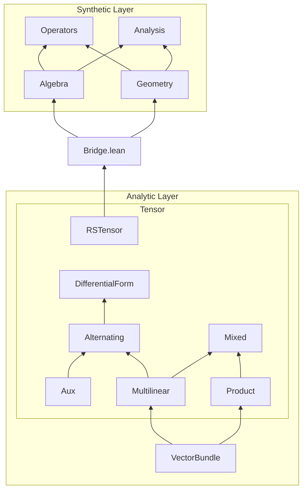

# Differential Geometry in Lean 4

A lightweight, self-contained formalization of differential geometry in Lean 4. See [differential-geometry-papers](https://github.com/qinz1yang/differential-geometry-papers) for using the library to formalize papers in differential geometry.


## Project Structure


## Background

In Synthetic Layer, We are treating:
- **Smooth Functions ($R$):**  as a commutative ring.
- **Space of Smooth Vector Fields Γ(TM):**  as a module ($V$) over $R$.
- **Vector Fields:**  as derivations.

## Philosophy

This library prioritizes algebraic structure over topological construction. 

* **Coordinate Insensitivity:** The framework operates entirely without local charts. However, on the user side, concrete coordinate calculations can be executed seamlessly by instantiating the module with explicit spaces (see `EuclideanSample.lean`).
* **Axiom Injection:** Analytical bottlenecks (e.g., PDE existence, maximum principles) can be easily isolated and injected as axioms by the user. This permits strict algebraic verification of tensor evolutions (e.g., Ricci flow) without the prerequisite of building topological manifolds.
* **Abstract definition:** Higher-order derivatives and complex geometric flows are constructed via pure functional composition rather than hardcoded index manipulations.

## API

### Analytic Layer

Built on Mathlib's smooth manifold library. The **VectorBundle** module provides foundational infrastructure: module structure for smooth sections ($\Gamma^n(V)$) over the ring of smooth functions, local-to-global frame extensions via bump functions, bundle homomorphisms/equivalences, and dual bundle constructions.

The **Tensor** module builds on this to formalize tensor algebra over vector bundles:

| Subfolder | Description |
|---|---|
| **Aux** | Combinatorial utilities: permutations, multi-index Kronecker deltas, and shuffle decompositions for graded Leibniz rules. |
| **Multilinear** | Vector bundles of continuous multilinear maps, with fiber/bundle/section-level constructions for duals and tensor products. |
| **Product** | Tensor products of vector bundles, including pretrivializations, fiber structure, and explicit basis/finrank computations. |
| **Mixed** | Mixed $(r,s)$-tensor bundles realized as hom bundles between multilinear bundles, with dual fiber isomorphisms. |
| **Alternating** | Continuous alternating multilinear maps: wedge products (via shuffle decomposition), currying, and Fréchet derivatives. |
| **DifferentialForm** | Smooth differential $n$-forms as sections of alternating bundles. |
| **RSTensor** | Classical $(r,s)$-tensor fields on smooth manifolds: contractions, metric structures, and Lie derivatives. |

**Bridge** connects the two layers by instantiating all synthetic typeclasses on concrete smooth manifolds, proving that Mathlib's manifold definitions satisfy the abstract axioms.

### Synthetic Layer

Operates abstractly over a commutative ring $R$ and module $V$, with no dependence on charts or topological structure.

| Folder | Description |
|---|---|
| **Algebra** | Foundational structures: vector fields as derivations, Lie brackets, abstract bilinear forms (0,2)-tensors, metric tensors, musical isomorphisms, and trace operators. |
| **Geometry** | Core geometric objects: affine connections (covariant derivatives, Christoffel symbols), Riemann/Ricci/scalar curvature, conformal transformations, and the fundamental identities (Bianchi, Ricci). |
| **Operators** | Differential operators: gradient, Hessian, Laplacian, divergence, Lie derivative, second covariant derivative, spatial constants, time derivatives, and metric variation. |
| **Analysis** | Higher-order tensor analysis: universal covariant derivative extending to arbitrary $(r,s)$-tensors, and inner products of (0,2)-tensors. |

## Proven Theorems
- **Bochner-Weitzenböck Identity:** 
  > If $f \colon M \rightarrow \mathbb{R}$ is a smooth function, then 
  > $$\Delta |\nabla f|^2 = 2 |\nabla^2 f|^2 + 2 \text{Ric}(\nabla f, \nabla f) + 2 g(\nabla f, \nabla \Delta f)$$
  
  Theorem: `bochner_identity` in `DifferentialGeometry/Operators/Bochner.lean`
- **Conformal Modification of Connection:** 
  > If $\nabla$ is a torsion-free connection on a manifold $M$, then its conformal transformation via a scalar function $u \in C^\infty(M)$ strictly preserves the torsion-free property.
  
  Theorem: `conformal_torsion_free` in `DifferentialGeometry/Geometry/Conformal.lean`
- **Contracted Bianchi Identity:** 
  > If $\nabla$ is a torsion-free connection on a manifold $M$, the divergence of the Ricci tensor is half the gradient of the scalar curvature:
  > $$\text{div}(Rc) = \frac{1}{2} \nabla R$$
  
  Theorem: `contracted_bianchi` in `DifferentialGeometry/Geometry/Bianchi.lean`
- **First Bianchi Identity:** 
  > If $\nabla$ is a torsion-free connection on a manifold $M$, then for any vector fields $X, Y, Z \in \mathfrak{X}(M)$, the Riemann curvature tensor $R$ satisfies
  > $$R(X,Y)Z + R(Y,Z)X + R(Z,X)Y = 0$$
  
  Theorem: `first_bianchi` in `DifferentialGeometry/Geometry/Bianchi.lean`
- **Second Bianchi Identity:** 
  > If $\nabla$ is a torsion-free connection on a manifold $M$, then for any vector fields $X, Y, Z, W \in \mathfrak{X}(M)$, the covariant derivative of the Riemann curvature tensor $R$ satisfies the differential identity:
  > $$(\nabla_X R)(Y,Z)W + (\nabla_Y R)(Z,X)W + (\nabla_Z R)(X,Y)W = 0$$
  
  Theorem: `second_bianchi` in `DifferentialGeometry/Geometry/Bianchi.lean`
- **Fundamental Theorem of Riemannian Geometry:** 
  > For any Riemannian manifold $(M, g)$, there exists a unique affine connection $\nabla$ (the Levi-Civita connection) such that for all vector fields $X, Y, Z \in \mathfrak{X}(M)$:
  > $$[X, Y] = \nabla_X Y - \nabla_Y X \quad \text{and} \quad X(g(Y, Z)) = g(\nabla_X Y, Z) + g(Y, \nabla_X Z)$$
  
  Theorem: `levi_civita_exists_unique` in `DifferentialGeometry/Geometry/Connection.lean`
- **Integration by Parts (Green's First Identity):** 
  > Assuming the global integral of a divergence vanishes ($\int \text{div}(X) = 0$), then for any vector field $X$ and scalar function $f$, Green's first identity is algebraically satisfied:
  > $$\int f \text{div}(X) + \int X(f) = 0$$
  
  Theorem: `integration_by_parts` in `DifferentialGeometry/Operators/Divergence.lean`
- **Li-Yau Harnack Inequality (1D):** 
  > On a static, flat Riemannian manifold, if positive smooth function $u$ solves the heat equation $\partial_t u = \Delta u$, then for $f = \log u$, the algebraic Harnack quantity $Q = t(|\nabla f|^2 - \partial_t f) - \frac{1}{2}$ completes the 1D estimate.
  
  Theorem: `harnack_inequality` in `DifferentialGeometry/Applications/LiYau1D.lean`
- **Lie Derivative of Metric Tensor:** 
  > If $\nabla$ is a torsion-free, metric-compatible connection on a manifold $M$, then for any vector fields $X, Y, Z \in \mathfrak{X}(M)$, the Lie derivative of the metric $g$ along $X$ is equivalently formulated using the symmetrized covariant derivative:
  > $$(\mathcal{L}_X g)(Y, Z) = g(\nabla_Y X, Z) + g(Y, \nabla_Z X)$$
  
  Theorem: `lieDerivMetric_eq_nabla` in `DifferentialGeometry/Operators/LieDerivative.lean`
- **Palatini Identity:** 
  > The variation of the Levi-Civita connection under a metric variation $h = \partial_t g$ is algebraically derived via the Koszul formula equivalent:
  > $$2 g((\partial_t \nabla)_X Y, Z) = (\nabla_X h)(Y, Z) + (\nabla_Y h)(X, Z) - (\nabla_Z h)(X, Y)$$
  
  Theorem: `connection_variation` in `DifferentialGeometry/Operators/Variation.lean`
- **Ricci Identity:** 
  > If $\nabla$ is a torsion-free connection on a manifold $M$, then for any vector fields $X, Y, Z \in \mathfrak{X}(M)$, the commutator of the second covariant derivative satisfies
  > $$\nabla^2_{X,Y} Z - \nabla^2_{Y,X} Z = R(X,Y)Z$$
  
  Theorem: `ricci_identity` in `DifferentialGeometry/Geometry/RicciIdentity.lean`

  
## Proven Properties

Highlights include Hessian symmetry, the Jacobi identity, Riemann curvature tensoriality, Ricci bilinearity, metric compatibility of the covariant derivative, and operator linearity for gradient, Laplacian, and divergence.

The library also supports **ordered tensors** (positivity of bilinear forms, algebraic spatial maximum principles, trace order rules) and **geometric flows** (Ricci Flow evolution equation, Levi-Civita connection property).

For the complete list of verified properties, see [PROPERTIES.md](PROPERTIES.md).

## Limitations
This library inherently assumes:
* **Intrinsic Smoothness:** Smoothness and convergence are absorbed by the type system. The framework cannot model Sobolev spaces, distributions, or measure-theoretic jump functions.
For singularities occurred at time $T$, such as in Ricci Flow, we would have to work on $t \in [0,T)$, before the metric degenerates.
* **Strict Non-degeneracy:** The musical isomorphism (`InverseMetric`) enforces a strict bijection. The framework effectively assumes **finite-dimensional** manifolds.


## Installation

Ensure you have [Lean 4](https://lean-lang.org/lean4/doc/setup.html) installed.

```bash
# Clone the repository
git clone https://github.com/qinz1yang/differential-geometry
cd differential-geometry

# Build the library
lake build
```

## How to use?
### There are examples in `Examples` folder. One illustrates calculation, one illustrates proof.
- **`EuclideanSample.lean`:** Calculation of gradient, Hessian, Laplacian, metric variation, and Ricci curvature in $\mathbb{R}^3$.
- **`HessianSymmetry.lean`:** Proof of Hessian symmetry using Lie derivations. (This is already in the library, but it is a good example.)


## Contributing

Contributions and suggestions are welcome. Please discuss with me via email:
`zq + sqrt(1444) {at} cornell [dot] edu`

(all lower case, no symbols)

## References
The abstractions and formalizations in this library are heavily inspired by and built upon the following texts:

- Chow, B., et al. Hamilton's Ricci Flow (ISBN 978-1-4704-7369-3).
- Colding, T. H., & Minicozzi II, W. P. A Course in Minimal Surfaces (ISBN 978-1-4704-7640-3).
- Differential Geometry and Applications, Richard Hamilton, Monique Chyba and Xiaodong Cao (This is not published yet.)
- Hongxi Wu, An Introduction to Riemannian Geometry. (2014). Higher Education Press. (This is not a book in English, but it can be found [here](https://www.overdrive.com/media/12444682/黎曼几何初步-preliminary-riemann-geometry). ISBN 978-7-04-040458-6)

## Axioms and Assumptions

The irreducible mathematical axioms injected into the system are categorized below. Purely structural type definitions (e.g., the existence of a trace operator or scalar multiplication) are omitted from this list.

**Algebraic & Differential Rules**
- **`BianchiContractionRules`** — Axiomatizes the commutation and linearity of traces with covariant derivatives required to rigorously contract the Second Bianchi Identity.
- **`DerivationRules`** / **`ActionLinear`** — Full Leibniz and linearity rules for the derivation action: $(X+Y)f = Xf + Yf$, etc.
- **`IsSpatialConstant`** — Axiomatizes a scalar whose spatial derivation vanishes automatically.
- **`LieDerivation`** — The Lie bracket acts strictly as a commutator of derivations: $[X, Y]f = X(Yf) - Y(Xf)$.
- **`TraceLinearityRules`** — The trace operators (both abstract and metric-dependent) are additive and homogeneous.

**Riemannian Geometry**
- **`MetricDuality`** — The metric is non-degenerate and equipped with a strictly inverting sharp operator $\sharp$, acting as a bijection such that $g(\sharp\omega, Z) = \omega(Z)$.
- **`MetricCompatible`** — The connection preserves the metric: $Xg(Y, Z) = g(\nabla_X Y, Z) + g(Y, \nabla_X Z)$.
- **`TorsionFree`** — The connection is torsion-free: $\nabla_X Y - \nabla_Y X = [X, Y]$.

**Analysis & Topology (Blackboxed)**
- **`DivergenceTheorem`** — The global integral of a divergence vanishes: $\int \text{div}(X) = 0$.
- **`SpatialMaximum`** — At a spatial maximum of a scalar function $f$, the gradient vanishes ($\nabla f = 0$) and the Hessian is negative semi-definite ($\text{Hess}(f) \le 0$).
- **`TraceOrderRules`** — The metric trace of a positive semi-definite bilinear form is non-negative: $T \ge 0 \implies \text{tr}_g(T) \ge 0$.

**Time Evolution**
- **`RicciFlow`** — A one-parameter family of metrics $g(t)$ evolves by the Ricci flow equation: $\partial_t g = -2\text{Rc}$.
- **`StaticMetricTimeRules`** — Axiomatizes that fundamental spatial operators are invariant under time derivatives when the underlying metric is static.
- **`TimeDerivativeRules`** — The time derivative operator $\partial_t$ is linear.
- **`TimeWeight`** — Axiomatizes properties of continuous time inverse weights (e.g., $1/t$), ensuring parameters map correctly within valid time domains.

## Future Work

The following axioms should be downgraded to formal theorems in future iterations.

- **`MetricTraceRankOneRules` & `MetricTraceCyclic`** — Should emerge from restricting $V$ to a finitely generated projective module over $R$.
- **`BochnerTraceRules`** — Should be derived via a generalized tensor contraction framework.